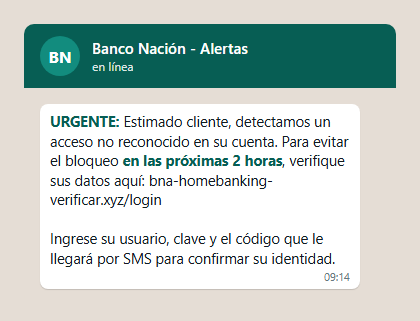

# Guía de demo — Protegete

Guía rápida para levantar el proyecto y mostrarlo en vivo: backend, PWA y
extensión de Chrome (y la PWA desde el celular), con 9 casos de prueba y sus respuestas reales.

## Requisitos

- **uv** instalado (gestor de paquetes de Python). `uv --version` para
  confirmar.
- **Node 24** (o compatible) instalado. `node --version` para confirmar.
- **Ollama** con sesión iniciada y el modelo `nemotron-3-nano:30b-cloud`
  disponible:
  ```bash
  ollama signin
  ollama pull nemotron-3-nano:30b-cloud
  ```
  Este modelo corre en **Ollama Cloud** (no local), elegido por la RAM
  limitada de la máquina de demo. Es la capa B del chat (explicación
  conversacional adicional); si Ollama no está disponible, la app sigue
  funcionando igual con la capa A (ver "Si algo falla en vivo" más abajo).

## Cómo levantar todo

### 1. Backend

```bash
cd backend
uv sync            # solo la primera vez
uv run uvicorn app.main:app --port 8000
```

Requiere que la carpeta `MODULO-PY/` (modelo ML + reglas del motor,
provista por el equipo) esté presente en la raíz del repo — el backend la
importa en modo lectura, nunca la modifica.

### 2. PWA

```bash
cd frontend
npm install         # solo la primera vez
npm run build
npx vite preview --port 4173
```

Abrir **http://localhost:4173** en el navegador.

### 3. Extensión de Chrome

```bash
cd frontend
npm run build:ext
```

Luego, en Chrome/Chromium:

1. Ir a `chrome://extensions`.
2. Activar **Modo desarrollador** (arriba a la derecha).
3. Click en **Cargar descomprimida**.
4. Seleccionar la carpeta `frontend/dist-extension`.

El ícono de la extensión aparece en la barra de herramientas; un click abre
el panel lateral con el veredicto de la pestaña activa, las métricas y el
chat.

### 4. Desde el celular (PWA por HTTPS)

La cámara (para escanear QR) y la instalación de la PWA exigen HTTPS, así
que la PWA se expone con un túnel gratuito de Cloudflare (sin cuenta).
Con el backend ya levantado en el puerto 8000:

```powershell
cd frontend
powershell -ExecutionPolicy Bypass -File scripts\phone.ps1
```

El script hace `npm run build`, levanta `vite preview` en el 4173 y abre
el túnel. En la terminal aparece una URL `https://*.trycloudflare.com`:
abrirla en el celular (o generar un QR de esa URL para el jurado). La PWA
llama al backend por la ruta relativa `/api`, que `vite preview` reenvía
al puerto 8000, así que no hace falta exponer el backend aparte. Ctrl+C
corta el túnel y el servidor.

La extensión no cambia: sigue llamando a `http://localhost:8000`.

**Para que el jurado la abra en su celular:** con el túnel ya corriendo,
generar una página con un QR "Entrá a Protegete" que apunte a la URL
`https://*.trycloudflare.com` del momento y mostrarla en pantalla. El
jurado la escanea con la cámara normal del celu (sin instalar nada; si
quiere, "Agregar a pantalla de inicio"). Los QR de prueba
(`demo/qr/qr-demo.html`) tienen que estar en **otra** pantalla o impresos:
un celu no puede escanear un QR de su propia pantalla.

- La URL cambia cada vez que se reinicia el túnel: levantarlo justo antes
  de presentar y regenerar el QR "Entrá acá" con esa URL.
- Todo pasa por la notebook: desactivar la suspensión y dejarla
  enchufada.
- Plan B si el túnel gratuito falla: hacer la demo desde un celular
  propio o desde http://localhost:4173 en la notebook.

## Checklist de 1 minuto antes de la demo

1. **Backend arriba:**
   ```bash
   curl http://localhost:8000/api/health
   # esperado: {"status":"ok","model_version":"4c"}
   ```
2. **PWA abierta:** http://localhost:4173 muestra la pantalla vacía con los
   3 botones de ejemplo ("Probar un mensaje falso", "Probar un link
   sospechoso", "¿Cómo me doy cuenta de una estafa?").
3. **Ollama corriendo:** `ollama list` no debe fallar (o el ícono de Ollama
   está activo). Si falla, la demo sigue: el chat solo pierde la respuesta
   conversacional adicional (capa B), no el veredicto principal (capa A).

## 9 casos de demo

Todos los casos fueron ejecutados contra el backend real (no simulados)
el 2026-09-24.

### Caso 1 — Link falso de banco

**Input:** `http://bna-homebanking-verificar.xyz/login`

```bash
curl -s -X POST http://localhost:8000/api/analyze \
  -H "Content-Type: application/json" \
  -d '{"url":"http://bna-homebanking-verificar.xyz/login"}'
```

**Salida real observada:**
- `level: "danger"`, `category: "blacklisted"`, `score: 1.0`
- Razones:
  - "Este dominio está en nuestra lista negra de sitios reportados como fraudulentos (bna-homebanking-verificar.xyz)"
  - "El análisis automático del dominio lo considera muy similar a sitios fraudulentos conocidos."
  - "El dominio tiene varios guiones, algo común en sitios falsos"
  - "El dominio contiene palabras típicas de engaños (login, verificar, clave, entre otras)"
- Tip: "Este sitio fue reportado como fraudulento: no ingreses datos ni sigas navegando en él."
- ML: `probability: 0.973`, `flagged: true`, features top: `cant_guiones`, `cant_palabras_sospechosas`, `tld_comun`.

### Caso 2 — SMS de estafa

**Input:** `URGENTE: tu cuenta del Banco Nación será suspendida. Pasame el código que te llegó por SMS`

```bash
curl -s -X POST http://localhost:8000/api/analyze-text \
  -H "Content-Type: application/json" \
  -d '{"text":"URGENTE: tu cuenta del Banco Nación será suspendida. Pasame el código que te llegó por SMS"}'
```

**Salida real observada:**
- `level: "danger"`, `category: "impersonation"`, `score: 0.95`
- Señales detectadas: `urgency` (evidencia "URGENTE"), `credential_request`
  (evidencia "código"), `brand_mention` (evidencia "Banco Nación").
- Razones:
  - "Usa apuro y urgencia para que no pienses antes de actuar."
  - "Te pide una clave o código: ningún banco lo hace por mensaje."
  - "Menciona una marca conocida: verificá que sea realmente su canal oficial."
- Tip: "No respondas ni hagas clic: verificá por los canales oficiales antes de hacer nada."
- 3 lecciones asociadas: "Te apuran para que no pienses", "Te piden tu clave
  o código", "Se hace pasar por una empresa conocida".

En la PWA: pegar el texto en el composer muestra la tarjeta de veredicto
⛔ Peligroso con el resumen y las 3 lecciones debajo.

### Caso 3 — Captura de WhatsApp

**Input:** una captura de chat de WhatsApp (imagen) con un mensaje de
estafa suplantando al banco. Generada para esta demo:
`demo/whatsapp-estafa.png`.



En vivo: usar el botón 🖼️ del composer (o pegar la imagen) para subirla.
El OCR corre en el dispositivo (tesseract.js) y extrae el texto, que se
analiza igual que el caso 2. Texto extraído y analizado para esta guía:

```
URGENTE: Estimado cliente, detectamos un acceso no reconocido en su cuenta.
Para evitar el bloqueo en las proximas 2 horas, verifique sus datos aqui:
bna-homebanking-verificar.xyz/login. Ingrese su usuario, clave y el codigo
que le llegara por SMS para confirmar su identidad.
```

**Salida real observada** (vía `POST /api/analyze-text` con ese texto):
- `level: "danger"`, `category: "blacklisted"`, `score: 1.0`
- 4 señales: `urgency`, `credential_request`, `impersonal_greeting`
  (evidencia "Estimado cliente"), `suspicious_link` (evidencia
  `bna-homebanking-verificar.xyz/login`).
- El link embebido en el texto también se resuelve como veredicto propio
  (`danger`, `blacklisted`) dentro de `urls[]`.
- 5 lecciones asociadas (urgencia, pedido de clave, link sospechoso, saludo
  impersonal, dominio falso).

### Caso 4 — Sitio legítimo

**Input:** `https://www.mercadopago.com.ar`

```bash
curl -s -X POST http://localhost:8000/api/analyze \
  -H "Content-Type: application/json" \
  -d '{"url":"https://www.mercadopago.com.ar"}'
```

**Salida real observada:**
- `level: "safe"`, `category: "none"`, `score: 0.15`, sin razones (lista
  vacía).
- Tip: "No se detectaron señales de phishing, pero igual revisá la
  dirección antes de ingresar datos sensibles."
- `details.whitelist: true` (dominio oficial reconocido), ML
  `probability: 0.278`, `flagged: false`.

### Caso 5 — Acortador de links

**Input:** `https://bit.ly/x`

```bash
curl -s -X POST http://localhost:8000/api/analyze \
  -H "Content-Type: application/json" \
  -d '{"url":"https://bit.ly/x"}'
```

**Salida real observada:**
- `level: "caution"`, `category: "hidden_destination"`, `score: 0.65`
- Razones:
  - "Es un link acortado: no se ve a qué sitio te lleva"
  - "El análisis automático del dominio lo considera muy similar a sitios fraudulentos conocidos."
  - "El link está acortado y oculta su destino real"
  - "El dominio es inusualmente largo"
- Tip: "Los links acortados ocultan su destino real: fijate a dónde llevan
  antes de hacer clic."
- ML `probability: 0.994`, `flagged: true`, features top: `es_acortador`,
  `tld_comun`, `longitud_dominio`.

### Caso 6 — Sitio de fútbol pirata (sin marca que imitar)

**Input:** `https://futbollibrefullhd.org/` (sitio argentino de fútbol
pirata gratis; la familia futbollibre/rojadirecta/pelotalibre es conocida
por publicidad engañosa, botones de "play" falsos y pop-ups con virus, y
cambia de dominio constantemente -- Chrome/Edge ya lo marcan como
peligroso vía Google Safe Browsing / Microsoft SmartScreen).

```bash
curl -s -X POST http://localhost:8000/api/analyze \
  -H "Content-Type: application/json" \
  -d '{"url":"https://futbollibrefullhd.org/"}'
```

**Salida real observada:**
- `level: "danger"`, `category: "risky_site"`, `score: 0.85`
- Razón: "Es un sitio de fútbol o series gratis sin permiso: suelen tener
  publicidad engañosa, botones falsos y virus."
- Tip: "No hagas clic en los botones de 'Ver' ni descargues nada. Mirá los
  partidos en plataformas oficiales."
- Regla disparada: `pirate_streaming` (peso 0.85) -- un marcador de familia
  determinístico y 100% offline, no depende de la reputación online.
- ML `probability: 0.187`, `flagged: false` (el modelo entrenado no lo
  detecta solo: esta regla es la que cierra el hueco).
- `details.reputation: "unavailable"` (sin `GOOGLE_SAFE_BROWSING_API_KEY`
  configurada en esta demo).

Antes de esta mejora, la misma URL daba `safe` (score 0.145, sin reglas):
no hay marca que imitar, así que las reglas de impersonation/estructura de
URL no alcanzaban. Contraejemplo de sitio oficial que **no** se marca:
`https://www.tycsports.com/envivo` sigue dando `safe` (whitelist).

### Caso 7 — Página con código malicioso (inspección con consentimiento, Feature C)

A diferencia de los casos 1-6 (que solo analizan la URL), este caso muestra
la **inspección de la página en el navegador, con consentimiento explícito
del usuario**: dos content scripts de la extensión (`page-probe-main.ts`,
en el mundo JS de la página, y `page-probe.ts`, en el mundo aislado)
detectan comportamiento malicioso que ninguna URL por sí sola revela --
minería de criptomonedas, publicidad maliciosa, código ofuscado, iframes
escondidos, pop-ups/redirecciones forzadas, permiso de notificaciones ya
concedido -- y envían solo booleanos/contadores (nunca el HTML/JS de la
página, ni el texto de formularios) a `POST /api/analyze-page` para
enriquecer el veredicto base. **A diferencia de versiones anteriores de la
demo, estos content scripts ya NO se inyectan automáticamente en cada
sitio que visitás** (el manifest no declara `content_scripts` ni
`<all_urls>`): solo corren después de que el usuario toca "Sí, revisar
esta página" en la tarjeta de consentimiento del panel lateral. Ver
"Consentimiento y privacidad" más abajo para el flujo completo.

**Input:** `demo/pagina-maliciosa.html` (fixture local con un `<script
src="https://popads.net/pop.js">` de una red de malvertising conocida, un
`window.CoinHive = {}` -- global falso de un minero conocido -- seteado
apenas carga la página, un script inline con `eval(atob(...))` sobre una
cadena base64 larga, y un iframe cross-origin de 1x1px escondido fuera de
pantalla).

Levantarla localmente:

```bash
cd demo
python -m http.server 8765
```

Y abrir **http://localhost:8765/pagina-maliciosa.html** con la extensión
cargada (ver "3. Extensión de Chrome" más arriba). Abrí el panel lateral:
va a aparecer la tarjeta "🔍 ¿Querés que revise esta página a fondo?".
Tocá **"Sí, revisar esta página"** -- Chrome muestra su propio diálogo
nativo de permiso para el origen (`http://localhost:8765/*`); al aceptarlo,
la extensión inyecta el probe una vez, sin recargar. A los ~3-4 segundos el
ícono de la extensión pasa a `!` (peligro) y el panel lateral muestra:

**Salida real observada** (badge + veredicto cacheado, leídos vía
`chrome.action.getBadgeText` / `chrome.storage.session` en Chromium
headless contra el build real de `dist-extension/`):

- Badge: `"!"` (peligro)
- `level: "danger"`, `category: "malicious"`, `score: 1.0`
- `page_signals` (4, con sus lecciones asociadas):
  - `cryptominer` — "La página usa tu computadora para minar criptomonedas sin avisarte."
  - `malvertising` — "La página carga publicidad de redes conocidas por pop-ups engañosos y descargas falsas."
  - `obfuscated_js` — "Tiene código escondido a propósito, algo típico de sitios maliciosos."
  - `hidden_iframes` — "La página esconde ventanas invisibles (iframes) que pueden ejecutar código sin que lo notes."
- Tip: "Este sitio fue marcado como peligroso: no ingreses datos ni sigas navegando en él."
- 2 lecciones en el panel: "Publicidad engañosa y pop-ups" (📢) y "Código
  escondido y mineros" (🦠).

En vivo, en el panel lateral (`sidepanel.html`), la tarjeta "⛔ Peligroso ·
localhost" se expande a las 4 razones + lección, y debajo aparece la
sección plegable "🔍 Lo que encontramos en la página" con el mismo detalle
-- separada de la tarjeta principal para distinguir "lo que dice la URL"
de "lo que vimos al abrir la página".

### Caso 8 — Código QR falso (quishing)

**Input:** los 3 QR de `demo/qr/qr-demo.html` (imprimible, solo dice
"QR 1/2/3", sin revelar cuál es trucho):

| QR | Contenido | Veredicto esperado |
|----|-----------|--------------------|
| QR 1 | `http://bna-homebanking-verificar.xyz/login` | ⛔ Peligroso (igual que el caso 1) |
| QR 2 | `https://www.mercadopago.com.ar` | ✅ Seguro (igual que el caso 4) |
| QR 3 | `https://futbollibrefullhd.org` | ⛔ Peligroso (igual que el caso 6) |

En vivo, desde el celular: tocar el botón de QR del composer, apuntar la
cámara a la hoja. El QR se decodifica **en el dispositivo** (jsQR) y el
contenido pasa por el mismo análisis que una URL pegada a mano. Si el
veredicto no es seguro, se suma una advertencia específica de que el link
vino de un QR (los estafadores pegan QR falsos sobre carteles, mesas o
facturas) y la lección "Códigos QR falsos" (`fake_qr`).

Sin cámara (en la notebook o en la extensión): subir `demo/qr/qr-1.png`
con el botón 🖼️. Antes del OCR se intenta leer un QR; si hay uno, se usa
ese camino.

QR que no son links (Wi-Fi, teléfono, contacto) se describen en el chat
sin enviarse al backend.

### Caso 9 — "¿Ya caíste? Qué hacer ahora"

Protegete no solo avisa **antes** de caer: también acompaña **después**.

**Input A (en el chat):** `ya puse mis datos en un link del banco`

Respuesta inmediata, sin LLM y sin llamar al análisis: *"Tranqui,
actuemos rápido. Hacé esto ahora, en este orden:"* + la tarjeta 🆘 "¿Ya
caíste? Qué hacer ahora" desplegada: llamar al banco al número que figura
atrás de la tarjeta (nunca a uno que llegó por mensaje) y bloquear todo,
cambiar claves empezando por el mail con doble verificación, avisar si se
pasó un código y cerrar sesiones, guardar capturas como prueba, denunciar
en comisaría o fiscalía y, si se perdió plata, reclamar ante el BCRA en
usuariosfinancieros.gob.ar.

También se dispara con variantes como "me estafaron", "caí en una estafa",
"me robaron el WhatsApp", "les pasé el código", "ya hice la transferencia"
o "me hackearon" (sin importar tildes ni mayúsculas).

**Input B (desde un veredicto):** analizar el link del caso 1. Debajo del
veredicto ⛔ Peligroso aparece el botón *"¿Ya pusiste tus datos? Qué hacer
ahora"*; al tocarlo, se muestra la misma guía. Funciona igual en la PWA y
en el panel de la extensión.

### Dictado por voz y conversación de seguimiento

**Dictado 🎤 (solo PWA):** tocar el micrófono del composer, hablar, y el
texto aparece en el cuadro **sin enviarse solo**: la persona lo revisa y
lo manda. Si la app estaba leyendo algo en voz alta, se calla al empezar a
dictar. El botón solo aparece en navegadores que soportan reconocimiento
de voz (Chrome/Edge); en el panel de la extensión no se muestra.

**Salvedad honesta:** el dictado usa el reconocimiento de voz del
navegador; en Chrome, el audio lo procesa Google. Lo dice el propio
botón (tooltip). Es opcional: escribir sigue funcionando igual.

**Seguir la conversación:** después de un veredicto (por ejemplo, el QR 1),
escribir o dictar *"decime más sobre eso"* o *"y ahora qué hago"*. El chat
responde con el contexto del link anterior en lugar de analizar ese
mensaje como uno nuevo. Si en cambio se pega un mensaje con señales de
estafa (un SMS trucho), se analiza y muestra su propio veredicto.

### Consentimiento y privacidad (flujo completo, Feature B)

**El botero (siempre activo, sin leer la página).** Antes de cualquier
consentimiento, la extensión ya cuenta -- solo con eventos de navegación
del navegador (`chrome.webNavigation`, `chrome.tabs`), nunca leyendo el
contenido de la página -- cuántas ventanas/pestañas abrió una pestaña sola
(`popups_opened`) y cuántas redirecciones forzadas sufrió
(`forced_redirects`). Estos dos contadores viven solo en
`chrome.storage.session` (se borran al reiniciar el navegador) y se
reinician en cada navegación nueva de esa pestaña.

**Paso 1 -- pedir permiso.** El panel lateral muestra la tarjeta "🔍
¿Querés que revise esta página a fondo?" con el texto exacto: *"Miro el
código, los formularios, la publicidad y el texto que se ve. No guardo
nada y nunca leo lo que escribís en formularios."* Dos botones: "Sí,
revisar esta página" / "Ahora no", y un checkbox "Recordar para este
sitio". Nada se lee hasta que el usuario toca "Sí" -- en ese momento (y
solo en ese momento) se llama a `chrome.permissions.request` con el origen
exacto de esa pestaña, mostrando el diálogo **nativo** del navegador (no
uno nuestro) para ese permiso puntual.

**Paso 2 -- escaneo inmediato, sin recargar.** Con el permiso otorgado, la
extensión inyecta una vez los dos content scripts (`page-probe-main.js`
mundo MAIN, `page-probe.js` mundo aislado) en la pestaña actual, recolecta
las señales de página + hasta 5000 caracteres del **texto visible**
(`document.body.innerText`, nunca el HTML/JS crudo, nunca valores de
campos de formulario) y los envía a `/api/analyze-page` y
`/api/analyze-text`; el resultado combinado (nivel más alto gana, razones
sin duplicar) actualiza el badge, el veredicto y el contexto del chat.

**Paso 3 -- oferta de recarga (opcional).** El panel ofrece: *"Para ver
qué hace al abrirse (pop-ups, pedidos de notificaciones), la recargo una
vez con la revisión activa. ¿Dale?"* -- esto registra el mismo probe de
forma persistente solo para ese origen (`chrome.scripting
.registerContentScripts`) y recarga la pestaña una vez, para capturar
comportamiento que solo pasa al cargar la página (pop-ups automáticos,
pedidos de notificación). Si el usuario **no** marcó "Recordar para este
sitio", la extensión desregistra el probe ~6 segundos después de esa única
recarga -- el sitio vuelve a comportarse como cualquier otro sitio no
revisado. Si lo marcó, el sitio queda en la lista "Sitios que reviso
siempre" (configuración del panel, con botón "Quitar" por sitio) y se
revisa automáticamente en cada visita futura, sin volver a preguntar.

**Revisión de pantalla (opcional, Feature B.4).** Una vez escaneada la
página, aparece el botón "📸 Revisar también lo que se ve": captura la
pestaña visible (`chrome.tabs.captureVisibleTab`), hace OCR **en el propio
navegador** (tesseract.js -- la imagen nunca sale del dispositivo) y
analiza el texto extraído, agregando las razones con el prefijo "En la
pantalla: …" al veredicto. Útil para publicidades/pop-ups con texto
engañoso que no está en el DOM analizable directamente.

**Lo que nunca leemos, en ningún paso:** el HTML/JS crudo de la página,
valores de campos de formulario (ni siquiera de formularios sin
contraseña), cookies (solo se cuenta cuántas parecen ser de tracking, no
sus valores), ni la imagen de un screenshot (solo el texto que el OCR
extrae de ella, en el dispositivo).

**Pregunta del jurado: "¿Cómo respetan la privacidad?"** Nada se lee sin
que el usuario lo pida explícitamente sitio por sitio (no hay
`content_scripts` automáticos ni `<all_urls>` en el manifest desde esta
versión); el permiso lo otorga el diálogo **nativo** del navegador, no uno
nuestro; lo que se envía al backend son booleanos/contadores y hasta 5000
caracteres de texto *visible* (nunca HTML, scripts, ni campos de
formulario); el conteo de pop-ups/redirecciones usa solo eventos de
navegación, nunca contenido; el screenshot se procesa con OCR en el propio
dispositivo y solo el texto extraído viaja a la red; y todo permiso es
revocable en cualquier momento -- ya sea quitando el sitio de "Sitios que
reviso siempre", o desde el candado de la barra de direcciones de Chrome.

### Pregunta libre para el chat (capa B / LLM)

**Input:** `¿Cómo verifico si un mail del banco es realmente oficial?`

```bash
curl -s -X POST http://localhost:8000/api/chat \
  -H "Content-Type: application/json" \
  -d '{"message":"¿Cómo verifico si un mail del banco es realmente oficial?","context":null}'
```

**Salida real observada** (`fallback: false`, respondió en ~6.7s, dentro
del timeout de 8s):

> Nuestro sistema detecta intentos de suplantación de bancos de varias
> maneras. Por ejemplo, una señal es que el envío sea genérico: "Estimado
> cliente" suele ser una bandera roja. También revisa siempre la dirección
> del enlace: si tiene .xyz, .top o guiones extra, como en
> "bancoprovincia-verificacion.xyz", es probablemente falso. En caso de
> duda, ingresa directamente a la página oficial escribiendo la URL en tu
> navegador.
>
> **Consejo:** Si no estás seguro, llama al número que aparece en tu
> tarjeta o en la web oficial antes de hacer clic.

## Puntos para la defensa

- **La IA explica, pero no decide.** El veredicto (seguro/cuidado/peligroso)
  siempre sale de la capa determinística (reglas + listas + modelo ML
  entrenado, sin LLM). El chat con Ollama es una capa B puramente aditiva:
  agrega una explicación conversacional, nunca reemplaza ni contradice el
  veredicto.
- **Funciona aunque se caiga el LLM.** Si Ollama no responde o tarda más
  del timeout, `/api/chat` devuelve `{"answer": null, "fallback": true}` y
  la capa A (veredicto, razones, lecciones) sigue funcionando sin cambios.
- **Privacidad:**
  - No guardamos nada del contenido analizado en el backend (sin base de
    datos de mensajes/URLs de usuarios).
  - El OCR de imágenes corre **en el dispositivo** (tesseract.js), la
    imagen nunca se sube a ningún servidor.
  - Las métricas de la extensión son solo contadores (hoy/semana/total,
    con y sin distinción de peligrosidad) guardados localmente, con el
    dominio siempre hasheado (SHA-256) antes de guardarse — nunca en texto
    plano.
  - **Salvedad honesta:** el chat de capa B usa **Ollama Cloud**, no un
    modelo local. Eso significa que la pregunta del usuario y el contexto
    de señales verificadas (nunca la URL/mensaje crudo) sí salen del
    dispositivo hacia Ollama Cloud para esa respuesta puntual.
- **Enseña, no solo bloquea.** Cada veredicto de riesgo viene acompañado de
  hasta 3-5 tarjetas de lección (de un catálogo de 10) explicando cómo
  reconocer esa señal y qué hacer.
- **Accesible para todas las edades:** tipografía grande por defecto con
  toggle A/A+/A++, botón 🔊 "Escuchar" (Web Speech) en cada respuesta,
  contraste AA verificado, el veredicto siempre se comunica con color +
  ícono + palabra + frase (nunca solo color). Verificado con `axe`
  (`jest-axe`) en el test de accesibilidad de la PWA, sin violaciones
  serias/críticas.
- **Arquitectura:** FastAPI (backend) combinando reglas determinísticas +
  listas blanca/negra + un modelo ML entrenado (todo del equipo, en
  `MODULO-PY/motor`), más un endpoint de chat grounded sobre Ollama; Vite +
  React + TypeScript en el frontend, con un núcleo compartido (`src/core`)
  reusado por la PWA (`src/pwa`, instalable, con service worker) y la
  extensión Chromium MV3 (`src/extension`, side panel + badge en la
  barra de herramientas).

## Si algo falla en vivo

- **Ollama caído o lento:** el chat sigue respondiendo con la capa A
  (veredicto + razones + lecciones); solo falta el mensaje conversacional
  adicional. No hay error visible para el usuario.
- **Backend caído:** la PWA/extensión muestran un mensaje amigable ("No
  pude conectarme al analizador. Probá de nuevo en un momento.") y
  conservan lo que el usuario escribió, en vez de romper la interfaz.
- **Extensión con badge en blanco:** significa que la pestaña activa no es
  http/https (por ejemplo `chrome://` o una pestaña nueva) o que el
  análisis de esa URL falló silenciosamente (backend caído); no es un
  bug — es el estado "sin información" a propósito, para no mostrar un
  veredicto engañoso.

## Preguntas probables del jurado

**¿Qué tan preciso es el modelo?**
El modelo ML es una señal más, combinada con reglas y listas
blanca/negra — nunca decide solo. En los 5 casos de esta guía acertó en
todos (probabilidades entre 0.28 para el sitio legítimo y 0.99 para el
acortador), y el umbral de `flagged` (0.9) es conservador a propósito para
reducir falsos positivos en la salida final combinada.

**¿Qué pasa con los falsos positivos (un sitio real marcado como
peligroso)?** La whitelist de marcas oficiales corta directo a `safe`
antes de llegar al modelo ML, y el tip siempre invita a verificar en vez de
afirmar con certeza absoluta ("revisá la dirección antes de ingresar datos
sensibles"), incluso en el caso `safe`. El objetivo es reducir el riesgo
de decisión del usuario, no reemplazarla.

**¿Cómo se protege la privacidad si el chat usa un LLM en la nube?**
Solo la pregunta del usuario y el contexto ya verificado (nivel de riesgo +
señales, nunca la URL/mensaje original) se envían a Ollama Cloud, y
únicamente cuando el usuario hace una pregunta en el chat — el análisis
principal (capa A) es 100% local al backend, sin LLM. Esto está documentado
explícitamente en `backend/README.md`.

**¿Por qué no usar solo un LLM para todo el análisis?** Un LLM solo puede
alucinar veredictos, es más lento, y depende de un servicio externo que
puede caerse o no puede pagarse el pitch de siempre disponible. La capa A
determinística (reglas + listas + ML entrenado) es rápida, funciona
offline del LLM, y es auditable: cada razón mostrada viene de una regla o
señal explícita, no de una generación de texto libre.

**¿Esto escala?** La capa A no depende de infraestructura cara: reglas y
un modelo ML liviano corren en el mismo proceso FastAPI. La capa B (LLM) es
la única con costo variable por request, y es opcional/aditiva por diseño:
si el volumen crece, se puede limitar o cachear sin afectar el veredicto
principal, que es lo que efectivamente protege al usuario.

**¿Cómo inspeccionan la página sin comprometer la privacidad del
usuario?** Dos content scripts corren enteramente en el navegador del
usuario (`page-probe-main.ts` en el mundo JS de la página, para
interceptar `window.open`/`Notification.requestPermission` reales;
`page-probe.ts` en el mundo aislado, para leer el DOM) y calculan ahí mismo
un objeto fijo de booleanos y contadores (`cryptominer`, `malvertising`,
`obfuscated_js`, `hidden_iframes`, `popups`, etc. -- ver
`frontend/src/core/types.ts`'s `PageSignals`). Solo ese objeto y la URL
(ya enviada igual para el análisis base) viajan a `POST
/api/analyze-page`; el HTML, el texto de los scripts, y los valores de
cookies **nunca** salen del navegador -- ni se loguean ni se persisten en
el backend (mismo principio que `/api/analyze`/`/api/analyze-text`, ver
"Privacidad" en `backend/README.md`). Una señal de página débil por sí
sola tampoco alcanza "peligroso": el score de señales de página está
acotado a 0.6 salvo que se combine con algo más fuerte o el modelo ML ya
esté sobre el umbral.

**¿Por qué las cookies de seguimiento no son, por sí solas, prueba de que
un sitio es malicioso?** Cookies de analítica/publicidad
(`_ga`, `_fbp`, etc.) son extremadamente comunes en sitios legítimos --
casi cualquier sitio con Google Analytics o Meta Pixel las tiene. Por eso
`tracker_cookies` es la única señal de página explícitamente **informativa**
(`app/services/page_rules.py`): se muestra en el panel cuando hay varias,
pero nunca suma al score, nunca cambia `level`/`category`, y no tiene
lección asociada. Lo que sí es señal de riesgo real es comportamiento
activo y verificable -- un iframe escondido ejecutando código, un global
conocido de minero de criptomonedas, un script que hace `eval(atob(...))`
sobre una cadena larga, publicidad de una red conocida por malware -- no
la mera presencia de cookies.

**¿De dónde sacan la reputación de un sitio (caso 6, fútbol pirata)?**
De dos fuentes, ambas opcionales de combinar: una regla determinística y
100% offline (familia de marcadores de dominios conocidos de streaming
pirata, sin depender de ningún servicio externo) y, opcionalmente, Google
Safe Browsing v4 (la misma base que usa Chrome/Edge para las páginas rojas
de advertencia) si se configura una API key -- sin key, simplemente no se
hace esa llamada y el veredicto sigue funcionando igual con la regla
offline. Nunca dependemos de un solo proveedor externo para decidir.

**¿Por qué los QR?** El "quishing" (phishing por QR) crece porque el QR
esconde la URL: nadie puede leerla a simple vista antes de abrirla. En
Argentina se usan QR para pagar en todos lados, y hay casos de QR falsos
pegados encima de los reales. Protegete lee el QR en el celular, sin
abrir el link, y muestra el veredicto antes de que el usuario entre.

**¿La cámara manda imágenes a algún lado?** No. El QR se decodifica en el
propio navegador (jsQR, empaquetado en la app, sin CDN); solo el texto
decodificado va al backend, igual que si el usuario lo hubiera pegado. La
cámara se apaga apenas se lee el código o se cierra el diálogo.

**¿Y si la persona ya cayó?** La app no se queda en "era peligroso".
Detecta frases como "ya puse mis datos" o "me estafaron" y responde al
instante con pasos ordenados y concretos: bloquear la tarjeta con el
número oficial, cambiar claves, guardar pruebas, denunciar y reclamar ante
el BCRA. Es respuesta determinística, no depende del LLM.
